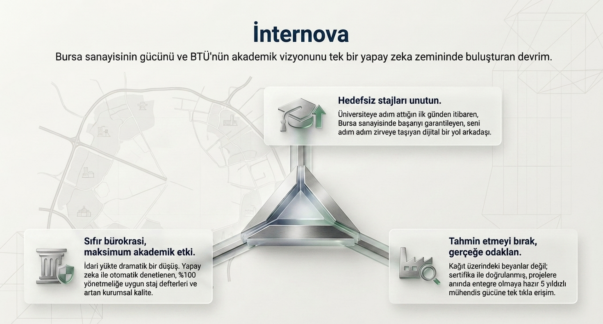
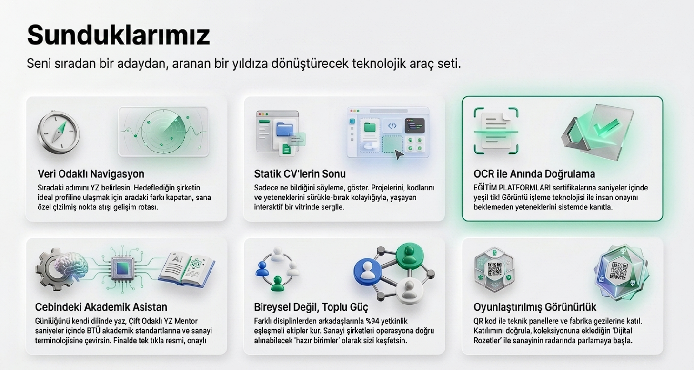

# 🎓 İnternovaYZ Kariyer Platformu

### Bursa Teknik Üniversitesi öğrencileri, öğretim üyeleri ve sanayi şirketleri için yapay zeka destekli kariyer ekosistemi

---

## 🎯 Projenin Amacı

**İnternovaYZ**, BTÜ ekosisteminde staj ve kariyer süreçlerini dönüştürmek için tasarlanmış kapsamlı bir yapay zeka platformudur. Öğrencilerin, öğretim üyelerinin ve Bursa sanayisinin tek bir çatı altında buluştuğu bu platform; staj defteri yazımı, sertifika doğrulama, takım kurma ve kariyer yol haritası gibi kritik süreçleri otomatikleştirir ve akıllı hale getirir.

### Çözmeye Çalıştığımız Problemler

- 📓 **Staj defteri kabusu:** Öğrencilerin büyük çoğunluğu staj defterini son ana bırakıyor ve 30 günlük raporu birkaç saatte yazmaya çalışıyor. Biz, günlük 1-2 cümlelik veri girişlerini yapay zekayla akademik bir dile dönüştürerek bu yükü ortadan kaldırıyoruz.
- 🎯 **Kariyer rehberliği eksikliği:** Öğrenciler hangi yetkinlikleri kazanmaları gerektiğini bilmiyor. Mezun verilerini analiz ederek ideal profil ile karşılaştırma sunuyoruz.
- 🤝 **Sanayi-üniversite kopukluğu:** Bursa şirketleri doğru öğrenciye, öğrenciler de doğru fırsata ulaşamıyor. Tek bir platformda buluşturuyoruz.
- 👥 **Proje takımı kuramama:** Öğrenciler bireysel projelerde takılıyor, ekip kurmak için bir yer yok. Yetkinlik eşleştirme algoritmasıyla takım kurma ortamı sunuyoruz.
- 📅 **Dağınık etkinlik bilgisi:** Şirket etkinlikleri ve üniversite duyuruları farklı kanallarda dağılmış durumda. Merkezi bir takvimle topluyoruz.

---

## 🚀 Hedeflerimiz

### Kısa Vadeli (2 ay - MVP)
- 4 sprintlik geliştirme süreciyle çalışır halde MVP çıkarmak
- BTÜ Bilgisayar Mühendisliği bölümünde pilot uygulama başlatmak
- En az 3 Bursa şirketi ile iş birliği protokolü imzalamak

### Orta Vadeli (6 ay)
- BTÜ'nün tüm mühendislik bölümlerine yaymak
- 500+ aktif öğrenci kullanıcıya ulaşmak
- 50+ doğrulanmış staj başvurusunun platform üzerinden işlenmesi

### Uzun Vadeli (1-2 yıl)
- Türkiye'nin diğer teknik üniversitelerine yayılım
- TÜBİTAK ve KOSGEB destek programlarına entegrasyon
- Sürdürülebilir SaaS modeline geçiş

---
##📘 Kullanım Kılavuzu
[Kılavuzu Görüntüle](src/kullanim-kilavuzu.pdf)

## 🛍️ Ürün Kataloğu

## 👥 Takım Üyeleri ve Görev Dağılımı

| # | Üye | Rol | Yetkinlikler | Sprint 1 Görevleri |
|---|-----|-----|--------------|---------------------|
| 1 | Halil Alpak | 👑 Proje Yöneticisi & DevOps | Scrum, Jira, GitHub Actions, Docker, Linux, CI/CD | Sprint planlama, Docker Compose kurulumu, GitHub Actions pipeline, secrets yönetimi, code review koordinasyonu |
| 2 | Mustafa Durmazer | 🔐 Backend Geliştirici (Auth) | Python, FastAPI, JWT, bcrypt, REST API | Register/login endpoint'leri, e-posta doğrulama, şifre sıfırlama, refresh token akışı |
| 3 | Yusuf Çil | 🗄️ Backend Geliştirici (DB & Middleware) | Python, PostgreSQL, SQLAlchemy, Alembic | Veritabanı şeması, migration dosyaları, JWT doğrulama middleware, rol bazlı guard |
| 4 | Rabia Celep | ⚛️ Frontend Geliştirici (Auth) | React, Tailwind CSS, Form validation, Axios | Kayıt/giriş ekranları, form validasyonu, backend entegrasyonu |
| 5 | Selenay Bulut | 🎨 Frontend Geliştirici (Design System) | React, Tailwind, Component design, Storybook | Tema ve renk paleti, temel UI bileşenleri (Button, Input, Card, Modal), Navigation/Sidebar |
| 6 | Melike Dal | 📊 Frontend Geliştirici (Dashboard) | React, Recharts, Chart.js, responsive design | Öğrenci dashboard, istatistik kartları, son başvurular listesi, aktif staj göstergesi |
| 7 | Sevde Betül Karakaş | 🖥️ Frontend Geliştirici (Şirket & Öğretmen) | React, Tailwind, REST API entegrasyonu | Şirket dashboard, öğretmen dashboard, role göre routing |
| 8 | Bilgenur Çakır | 🔧 Backend Destek & API Dokümantasyon | Python, FastAPI, OpenAPI/Swagger, Pytest | Yardımcı tabloların oluşturulması, seed data, Swagger dokümantasyonu, middleware testleri |
| 9 | Nihat Efe Bozkan | ✅ QA & Test Mühendisi | Pytest, Cypress, Selenium, manuel test | E2E test senaryoları, 3 rol için akış testleri, responsive testler, bug raporlama |

> **Not:** İlerleyen sprintlerde takım üyelerinin sorumluluk alanları sprint hedeflerine göre güncellenmektedir. Detaylı sprint planımız için [Jira board'umuza](#) göz atabilirsiniz.

---

## 🛠️ Yazılım ve Donanım Teknolojileri

### 💻 Frontend
- **React 18** — Component bazlı modern UI framework
- **Tailwind CSS** — Utility-first CSS framework
- **Chart.js / Recharts** — Veri görselleştirme (altıgen yetkinlik grafiği, dashboard chartları)
- **Axios** — HTTP client
- **React Router** — Sayfa yönlendirme

### ⚙️ Backend
- **Python 3.11+** — Ana geliştirme dili
- **FastAPI** — Yüksek performanslı modern Python web framework
- **SQLAlchemy** — ORM
- **Alembic** — Veritabanı migration aracı
- **Pydantic** — Veri doğrulama
- **JWT (python-jose)** — Token bazlı kimlik doğrulama
- **bcrypt** — Şifre hashleme

### 🗄️ Veritabanı & Önbellek
- **PostgreSQL 15** — Ana ilişkisel veritabanı
- **Redis** — Önbellek ve session yönetimi
- **Pinecone** — Vektör veritabanı (RAG mimarisi için)

### 🤖 Yapay Zeka & Makine Öğrenmesi
- **OpenAI GPT-4o** — LLM tabanlı staj defteri dönüştürme ve akıllı asistan
- **LangChain** — LLM orchestration ve RAG mimarisi
- **Google Vision API** — OCR ile sertifika doğrulama
- **OpenAI Embeddings** — Doküman vektörleme

### 🚢 DevOps & Altyapı
- **Docker & Docker Compose** — Konteyner yönetimi ve local geliştirme ortamı
- **GitHub Actions** — CI/CD pipeline
- **Nginx** — Reverse proxy
- **Linux (Ubuntu)** — Sunucu işletim sistemi

### 🔧 Geliştirme Araçları
- **Git & GitHub** — Versiyon kontrolü ve kod inceleme
- **Jira** — Sprint ve task yönetimi
- **VS Code** — Kod editörü
- **Postman** — API test
- **Figma** — UI/UX tasarım
- **ESLint, Prettier, Black, Flake8** — Kod kalite araçları

### 🖥️ Donanım Gereksinimleri
- **Geliştirme:** 8GB+ RAM, modern bir laptop yeterli (Docker desteği şart)
- **Sunucu (Production):** 4 vCPU / 8GB RAM / 100GB SSD (başlangıç)
- **Veritabanı:** Yönetilen PostgreSQL servisi (DigitalOcean / AWS RDS)
- **Yapay zeka servisleri:** Bulut tabanlı API kullanımı (kendi GPU gerektirmez)

---

## 🔄 Yazılım Geliştirme Süreci

### 📐 Metodoloji: **Scrum / Agile**

Projemizi Scrum metodolojisi çerçevesinde yürütüyoruz. Her şey ölçülebilir, izlenebilir ve esnektir.

---

## 👨‍💻 Yazılımcılara Çağrı: Bize Katılın!

İnternovaYZ açık kaynaklı bir projedir ve **size ihtiyacımız var**. Eğer:

- 🚀 Gerçek dünya etkisi olan bir projede çalışmak istiyorsanız
- 🎓 Üniversite-sanayi köprüsünde rol almak istiyorsanız
- 🤖 LLM, RAG, OCR gibi modern YZ teknolojileriyle pratik yapmak istiyorsanız
- 💼 Portfolyonuza ciddi bir referans eklemek istiyorsanız
- 🌱 Genç bir ekibe mentörlük yapmak istiyorsanız

**bu proje tam size göre.**

### Nasıl Katkıda Bulunabilirsiniz?

- ⭐ Repo'yu **yıldızlayın** ve takipte kalın
- 🍴 **Fork**'layıp pull request açın
- 🐛 [Issues](#) sekmesinden **good first issue** etiketli görevleri inceleyin
- 💬 [Discussions](#) bölümünde fikirlerinizi paylaşın
- 📖 `CONTRIBUTING.md` dosyasını okuyun (yakında!)

### Aradığımız Profiller

- **Frontend:** React, Tailwind, animasyon tutkunları
- **Backend:** Python/FastAPI, PostgreSQL deneyimi olanlar
- **Yapay Zeka:** LLM entegrasyonu, prompt mühendisliği bilenler
- **DevOps:** Kubernetes, monitoring tutkunları
- **UI/UX:** Figma kullanıcısı tasarımcılar
- **QA:** Test otomasyonu meraklıları
- **Teknik Yazar:** Dokümantasyon ve içerik üretiminde destek

### İletişim

📧 **internovayz@gmail.com**  •  💬 [Discord sunucumuz](#)  •  🐦 [Twitter](#)

---

## 💰 Yatırımcı ve Bağışçılara Çağrı: Geleceğe Birlikte Yatırım Yapalım

İnternovaYZ, sadece bir bitirme projesi değil; **Türkiye'nin teknik üniversite kariyer platformu standardı** olma vizyonuyla yola çıktığımız ciddi bir girişimdir.

### 📈 Neden Yatırım Yapmalısınız?

- 🎯 **Net pazar:** Türkiye'de 200+ üniversite, milyonlarca öğrenci ve binlerce şirketin ihtiyacını adresliyoruz
- 🤖 **Teknolojik üstünlük:** OCR, RAG, LLM gibi modern teknolojilerle rakipsiz bir kullanıcı deneyimi sunuyoruz
- 🏭 **Bursa sanayi ağı:** Türkiye'nin en yoğun sanayi şehirlerinden birinde pilot çalışmamız var
- 👥 **Genç ve hırslı ekip:** 9 kişilik adanmış geliştirici ekibi
- 🎓 **Akademik destek:** BTÜ öğretim üyeleri tarafından mentörlük alıyoruz

### 💎 Destek Olmak İçin Seçenekler

| Destek Tipi | Açıklama | Karşılığında |
|-------------|----------|--------------|
| 🌟 **Bireysel Bağış** | Her miktar değerli | İsminiz "Destekçilerimiz" sayfasında yer alır |
| 🏢 **Kurumsal Sponsorluk** | Şirket logonuz platformda | Brand görünürlüğü + erken pilot katılım |
| 🚀 **Yatırımcı Ortaklığı** | Eşitlik bazlı yatırım | Hisse + kurullarda söz hakkı |
| 🎓 **Akademik İş Birliği** | Üniversite & araştırma kurumu desteği | Ortak yayın + pilot uygulama |
| 💼 **Pilot Şirket Ortaklığı** | Sanayi şirketi olarak platforma katılma | İlk kullanıcı olma avantajı + öncelikli özellik talepleri |

### 🎁 Ne Sunuyoruz?

- **Beta erişim:** İlk yatırımcılarımız platformun erken sürümünü görür
- **Stratejik input:** Yatırımcılarımızın görüşleri ürün yol haritamızı şekillendirir
- **Şeffaflık:** Aylık ilerleme raporları, finansal raporlar
- **Etki raporu:** Platformun yarattığı somut sonuçların belgelenmesi (kaç staj sağlandı, kaç saat zaman tasarrufu vb.)
